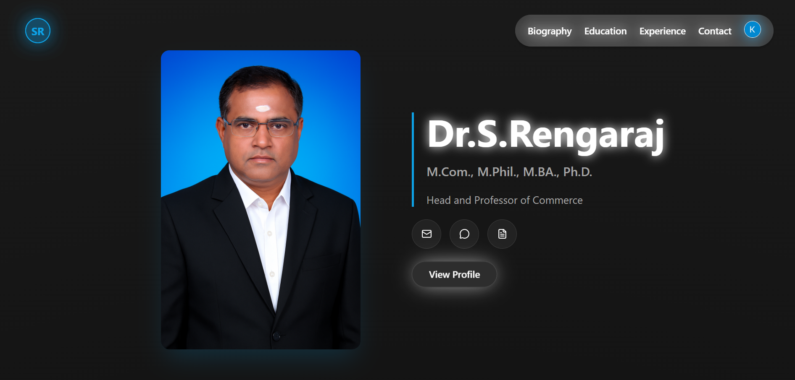

# 🎓 Dr. S. Rengaraj — Head of Commerce & Mentor to Thousands

<p align="center">
  
</p>

<div style="margin-top:10px" align="center">
  
  
  
  
  
  
  
  
  
</div>

<div align="center">
  <p>
<strong>Dr. S. Rengaraj — Head of Commerce & Mentor to Thousands</strong> is an interactive academic portfolio showcasing 25+ years of excellence in commerce education, research, and student mentorship.  
Built with modern web technologies and stunning visual effects, this digital profile serves as both a professional identity and an inspiration hub for learners and educators alike.
  </p>
  <p><a href="https://your-live-site-link.com" target="_blank"><strong>🌐 Visit Dr.S.Rengaraj'S Portfolio</strong></a></p>
</div>

---

## 📋 Table of Contents

1. [Introduction](#-introduction)
2. [Technical Description](#-technical-description)
3. [Tech Stack](#-tech-stack)
4. [Features](#-features)
5. [Quick Start](#-quick-start)
6. [Installation](#-installation)
7. [Development](#-development)
8. [Production Build](#-production-build)
9. [Deployment](#-deployment)
10. [License](#-license)
11. [Acknowledgements](#-acknowledgements)

---

### 🚀 Introduction

**Dr. S. Rengaraj — Head of Commerce & Mentor to Thousands** is a modern portfolio website designed to celebrate academic achievement, thought leadership, and mentorship.  
It highlights Dr. S. Rengaraj’s journey as a professor, researcher, and guide to thousands of students — presented through elegant design, smooth 3D animations, and professional storytelling.

---

### 🧠 Technical Description

This project is built as a **React + Three.js academic portfolio**, featuring immersive animations and smooth UI transitions.  
The architecture focuses on **performance, scalability, and accessibility**, integrating interactive components, secure communication, and modern motion design.

#### **Core Architecture**

- **Frontend:** React 19 + Vite for ultra-fast development and builds.
- **3D & Motion:** React Three Fiber + GSAP for animations and 3D effects.
- **Authentication:** Clerk React for secure login and access management.
- **Email Integration:** EmailJS for automated communication.
- **Styling:** Tailwind CSS + Radix UI + Shadcn for a clean and modern UI.
- **Hosting:** Vercel for seamless deployment.

---

### 🔧 Tech Stack (Summary)

- ⚛ **React 19**
- ⚡ **Vite**
- 🎨 **Tailwind CSS**
- 🌀 **GSAP Animations**
- 🧩 **React Three Fiber / Three.js**
- 📧 **EmailJS Integration**
- 🔐 **Clerk Authentication**
- 🧱 **Radix UI + Shadcn Components**
- ☁ **Vercel Deployment**

---

## ⚙ Features

- 🎓 **Professional Academic Portfolio Layout**
- 🧑‍🏫 **About Section — Teaching Philosophy & Achievements**
- 📚 **Publications & Research Works Display**
- 👨‍🎓 **Mentorship & Student Success Stories Section**
- 🖼️ **3D Animations & Parallax Effects (GSAP + Three.js)**
- 📨 **Contact & Collaboration via EmailJS**
- 🔐 **Secure Admin Section (Clerk Auth)**
- 🌍 **Fully Responsive + SEO Optimized Design**

---

## ⚡ Quick Start

### 📦 Prerequisites

- Node.js ≥ 18
- npm / yarn / pnpm

---

## 🛠 Installation

```bash
git clone https://github.com/KarthickRamAlagar/Dr.S.Rengaraj-Portfolio
cd sr-portfolio
npm install
```

## 🛠 Development

```bash
npm run dev
```

Your app will run locally at:
👉 http://localhost:5173

## 🏗️ Production Build

```bash
npm run build
```

<p> To preview the optimized production build:</p>
```bash
npm run preview
```
## 🙏 Acknowledgements

<p>React

Vite

Tailwind CSS

React Three Fiber / Three.js

GSAP

Clerk

EmailJS

Shadcn UI / Radix UI

Vercel</p>
